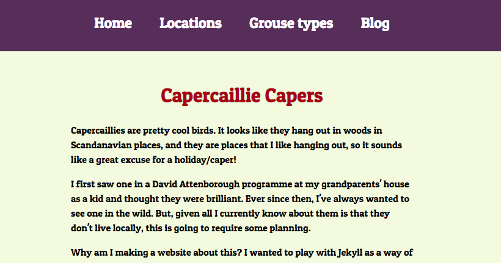

# Capercaillie Capers
I wanted to have a play around with Jekyll. I've been working with WordPress for a while and got all interested in JAMstack sites as an alternative. I figured I needed some content though, and I generally find the sillier the better, so I've made this site about capercaillies, and (hopefully) my future adventures in finding one in the wild.

[Visit Capercaillie Capers](https://webdevbev.co.uk/capercaillie-capers)

# 1. Technologies used
- Jekyll
- Sass

# 2. How to work with this project
- Clone down the project
- Run `jekyll serve` to get the local server up and running
- Refresh the browser when you want to see changes!

# 3. How to suggest a change
- Create an issue on the issues tab

# 4. What the project looks like
